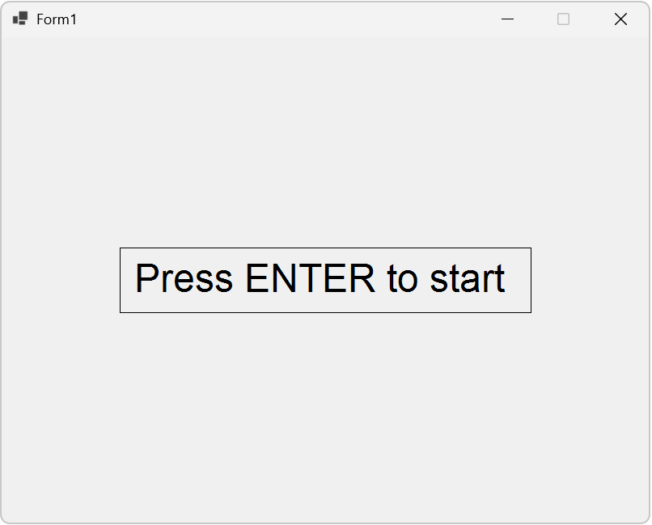
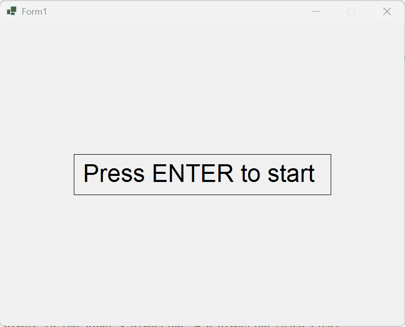

# Snake

This is a snake game written in C# with WinForms. First off you will be met with a "Press ENTER to start" text. The game will start when pressing the ENTER key. The screenshot below shows the home screen for the game. 

Below is a gif demonstrating how the game works from pressing ENTER to the snake eating its first food. The score will update from 0 to 1 when the snake eats the first food.

