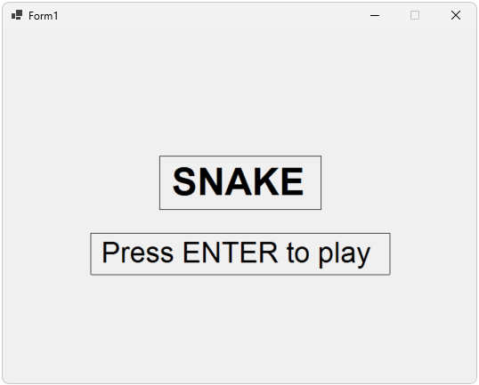
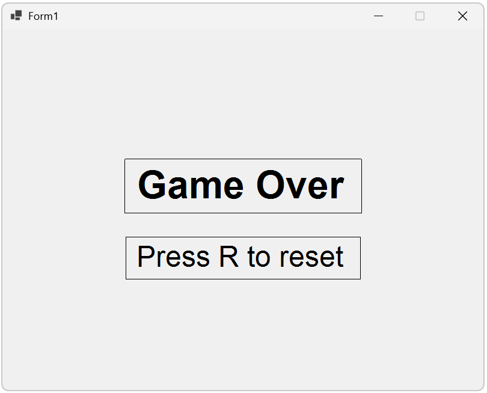

# Snake

A simple snake game built with C# and Windows Forms.






## Installation
1. Clone the repository:
```bash
git clone https://github.com/Stianao/Snake.git
```
2. Open the project in Visual Studio.
3. press f5 to run.

## Features
- Title screen and start game
- Snake movement with wrap-around edges
- Randomly spawning food
- Speed increasing as you score
- Snake collision stops game
- Game Over and Reset screen

## TODO
- Add more graphics